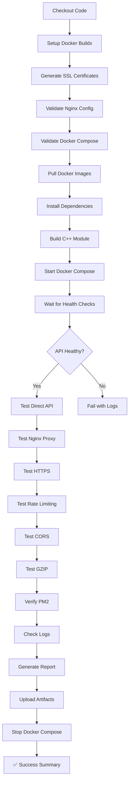

# AWS EC2 Environment Setup - CI Testing

## Overview

Automated GitHub Actions workflow to validate the local AWS EC2 environment setup. This ensures that the Docker Compose configuration, nginx setup, and API integration work correctly before deployment.

---

## Workflow Details

**File:** `.github/workflows/test-aws-ec2-setup.yml`

**Purpose:** Validates that the local AWS EC2 reproduction environment is correctly configured and functional.

---

## What Gets Tested

### 1. Configuration Validation ✅
- Docker Compose file syntax
- Nginx configuration syntax
- SSL certificate generation
- File structure and paths

### 2. Container Orchestration ✅
- Docker image pulling
- Container startup
- Service health checks
- Inter-container networking

### 3. Endpoint Testing ✅
- API direct access (port 3001)
- Nginx proxy (port 80)
- HTTPS access (port 443)
- Health check endpoints

### 4. Nginx Features ✅
- Rate limiting (10 req/s)
- CORS headers
- GZIP compression
- Reverse proxy functionality

### 5. Process Management ✅
- PM2 process verification
- Log collection
- Error detection

---

## Trigger Methods

### Manual Trigger
```bash
# Via GitHub UI
1. Go to repository → Actions
2. Select "Test AWS EC2 Environment Setup"
3. Click "Run workflow"
4. Select branch (usually 'main')
5. Click "Run workflow" button
```

### Automatic Triggers

**On Push:**
- Changes to `docker-compose.yml`
- Changes to `docker/nginx/**`
- Changes to `ecosystem.config.cjs`
- Changes to `scripts/generate-ssl-certs.sh`
- Changes to workflow file itself

**On Pull Request:**
- Same files as push triggers
- Validates changes before merge

---

## Test Execution Flow



---

## Expected Results

### Successful Run Output

```
✅ Docker Compose configuration is valid
✅ Nginx configuration syntax valid
✅ SSL certificates generated
✅ Containers are running
✅ API is healthy
✅ API direct endpoint working (HTTP 200)
✅ Nginx proxy endpoint working (HTTP 200)
✅ HTTPS endpoint working (HTTP 200)
✅ Rate limiting is working (got 429 after 10 requests)
✅ CORS headers present
✅ No critical errors in API logs
```

### Test Report Artifact

Generated for every run (30-day retention):
- Container status
- Service health checks
- Configuration validation
- Test results summary

---

## Common Issues & Solutions

### Issue: Container Startup Timeout

**Symptoms:**
```
❌ API health check failed
Attempt 30/30 - waiting for API...
```

**Cause:** API takes longer than 60 seconds to start

**Solution:** Already handled in workflow:
- 30 attempts with 2-second intervals (60s total)
- Logs displayed on failure
- Usually caused by dependency installation in container

### Issue: Port Conflicts

**Symptoms:**
```
Error: port is already allocated
```

**Cause:** Ports 80, 443, or 3001 in use on runner

**Solution:** GitHub runners are clean VMs, so this shouldn't occur in CI

### Issue: Rate Limiting Not Triggered

**Symptoms:**
```
⚠️ Rate limiting not triggered
```

**Cause:** Requests not fast enough to hit 10 req/s limit

**Solution:** This is expected - warning only, not a failure

---

## Workflow Configuration

### Timeout
- **Duration:** 15 minutes
- **Reason:** Allow time for image pulls and startup

### Runner
- **OS:** Ubuntu Latest
- **Reason:** Matches production-like Linux environment

### Dependencies
- Docker Buildx
- pnpm 9.15.4
- Node.js 20.19.6
- CMake & g++ (for C++ module)

---

## Artifacts

### Test Report (`test-report.md`)
- **Retention:** 30 days
- **Contents:**
  - Execution timestamp
  - Container status
  - Service health results
  - Configuration validation
- **Download:** Actions → Run details → Artifacts

---

## Integration with Other Workflows

### CI Workflow
- Runs tests on code changes
- Complements this environment validation

### Deployment Workflow
- Can run environment test before deployment
- Validates Docker setup matches production

### Suggested Usage
```yaml
# In deploy workflow, add step:
- name: Test Environment Setup
  uses: ./.github/workflows/test-aws-ec2-setup.yml
```

---

## Monitoring & Alerts

### Success Indicators
- All test steps pass
- Summary shows "✅ AWS EC2 Environment Setup Test Passed"
- No errors in container logs

### Failure Indicators
- Any test step fails
- Container doesn't start
- Endpoints return non-200 status
- Summary shows "❌ AWS EC2 Environment Setup Test Failed"

### GitHub Notifications
- Workflow run status emailed to repository owner
- Can configure Slack/Discord notifications via webhooks

---

## Local Testing

Before pushing changes, test locally:

```bash
# 1. Validate Docker Compose
docker compose config --quiet

# 2. Validate nginx syntax
docker run --rm \
  -v $PWD/docker/nginx/nginx.conf:/etc/nginx/nginx.conf:ro \
  nginx:alpine nginx -t

# 3. Start environment
docker compose up -d

# 4. Test endpoints
curl http://localhost:3001/health
curl http://localhost/api/health
curl -k https://localhost/api/health

# 5. Clean up
docker compose down -v
```

---

## Maintenance

### When to Update Workflow

1. **Docker Compose Changes**
   - New services added
   - Port mappings changed
   - Volume mounts modified

2. **Nginx Configuration Changes**
   - New proxy rules
   - SSL configuration changes
   - Rate limit adjustments

3. **Dependency Updates**
   - Node.js version change
   - pnpm version change
   - New system dependencies

4. **Test Coverage Expansion**
   - New endpoints to test
   - Additional security checks
   - Performance benchmarks

### Workflow Updates Checklist

- [ ] Update timeout if needed
- [ ] Add new test steps
- [ ] Update artifact retention
- [ ] Verify all paths are correct
- [ ] Test workflow with manual trigger
- [ ] Update this documentation

---

## Performance Metrics

### Typical Run Times
- **Total:** 8-12 minutes
- **Image Pull:** 2-3 minutes
- **Dependency Install:** 1-2 minutes
- **Container Startup:** 30-60 seconds
- **Tests:** 1-2 minutes
- **Cleanup:** 30 seconds

### Resource Usage
- **CPU:** ~2 cores
- **Memory:** ~4 GB
- **Disk:** ~2 GB
- **Network:** ~500 MB (image pulls)

---

## Best Practices

1. **Run Before Merging**
   - Always run on PRs touching Docker config
   - Review test report artifacts

2. **Keep Tests Fast**
   - Use health check endpoints
   - Avoid unnecessary delays
   - Parallel tests where possible

3. **Clear Error Messages**
   - Check logs on failure
   - Review test report
   - Use workflow annotations

4. **Version Control**
   - Keep workflow in sync with docker-compose.yml
   - Document breaking changes
   - Test locally first

---

## Related Documentation

- [LOCAL_ENVIRONMENT_GUIDE.md](../LOCAL_ENVIRONMENT_GUIDE.md) - Setup instructions
- [AWS_EC2_SETUP_TEST_RESULTS.md](../AWS_EC2_SETUP_TEST_RESULTS.md) - Test results
- [ENVIRONMENT_REPRODUCTION_SUMMARY.md](../ENVIRONMENT_REPRODUCTION_SUMMARY.md) - Implementation details
- [REPO_IMPROVEMENT_PLAN.md](../../plan/REPO_IMPROVEMENT_PLAN.md) - Overall plan

---

## Summary

This GitHub Actions workflow ensures that:
- ✅ Local AWS EC2 environment matches production
- ✅ Docker configuration is valid and functional
- ✅ All endpoints are accessible and healthy
- ✅ Nginx features work as expected
- ✅ Changes don't break the setup

**Status:** Fully automated, runs on every configuration change, provides detailed reports.
